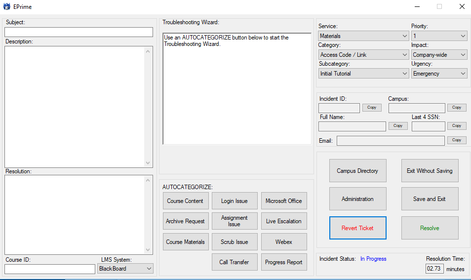
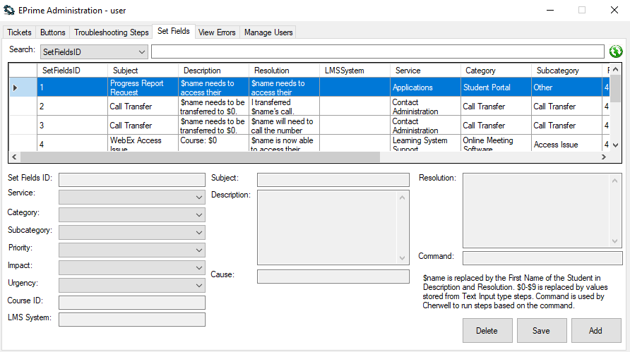
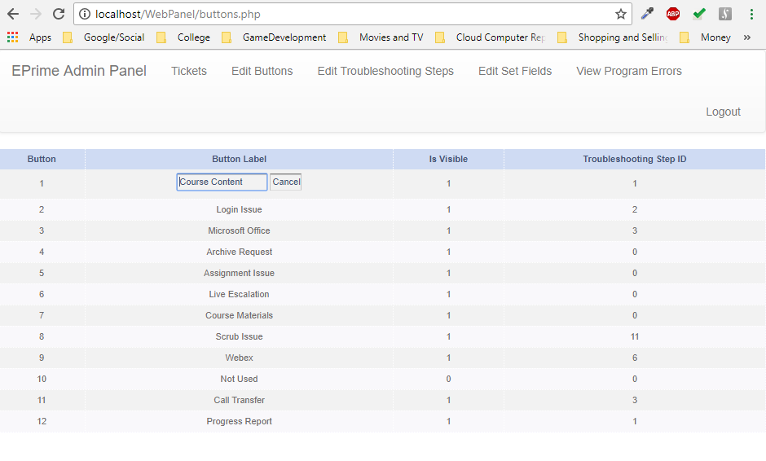
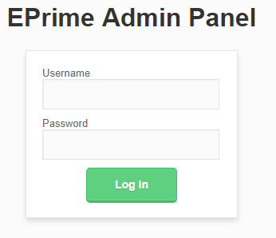
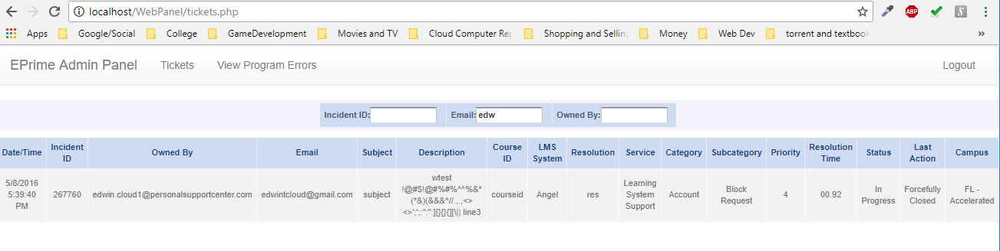

# EPrime
Cherwell Ticketing System Assistant

## Getting Started
The program is located in the `Release` folder. The Web administration panel is located in the `WebPanel` folder. Both use the MySQL database which can be imported using the SQL database dump file in the root directory.

#### WebPanel Setup
1. Open `config.php`
2. Change `DB_SERVER`, `DB_USERNAME`, `DB_PASSWORD`, and `DB_DATABASE` variables to match your configuration.
3. Host folder on Nginx or Apache server with PHP 5.6 or greater.

#### Program Setup
1. Open `Resources\db.txt` file and change variables to match your MySQL configuration.

## Program

## WebPanel

   
